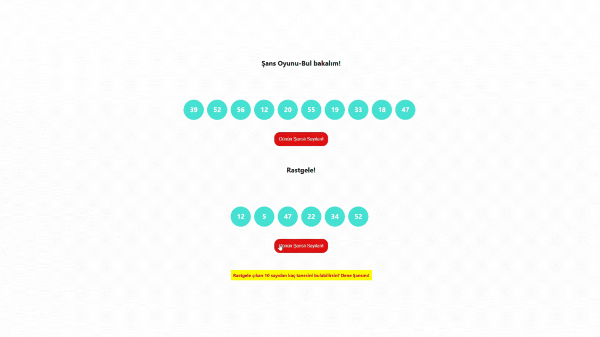

# 🎲 Random Number Guessing Game with React

This project was created using the **React** library, leveraging **React Hooks** to build a fun and interactive guessing game.

## 📋 Project Overview

In this game:

- A set of **10 random numbers** is generated.
- Additionally, **6 random numbers** are selected for you to guess.
- The challenge: **How many of these 10 random numbers can you guess correctly?**

The goal is to test your luck in this fun, lottery-style game!

## 🛠️ Technologies Used

- **React**
- **React Hooks**

---

I hope you enjoy playing this random guessing game! 🎉

## 🚀 Live Demo

